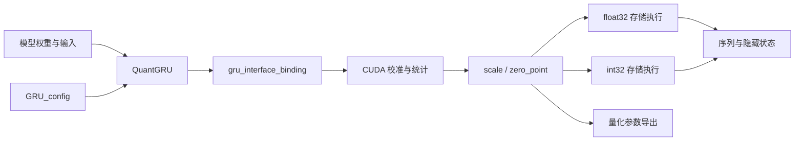
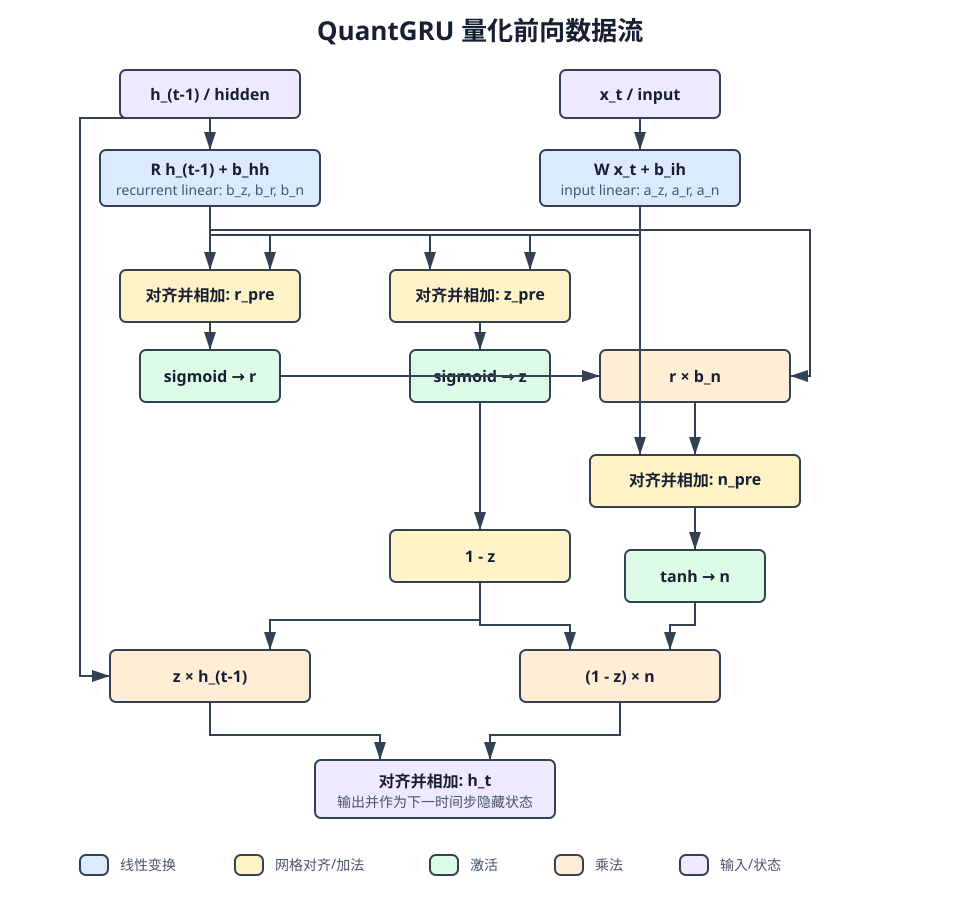
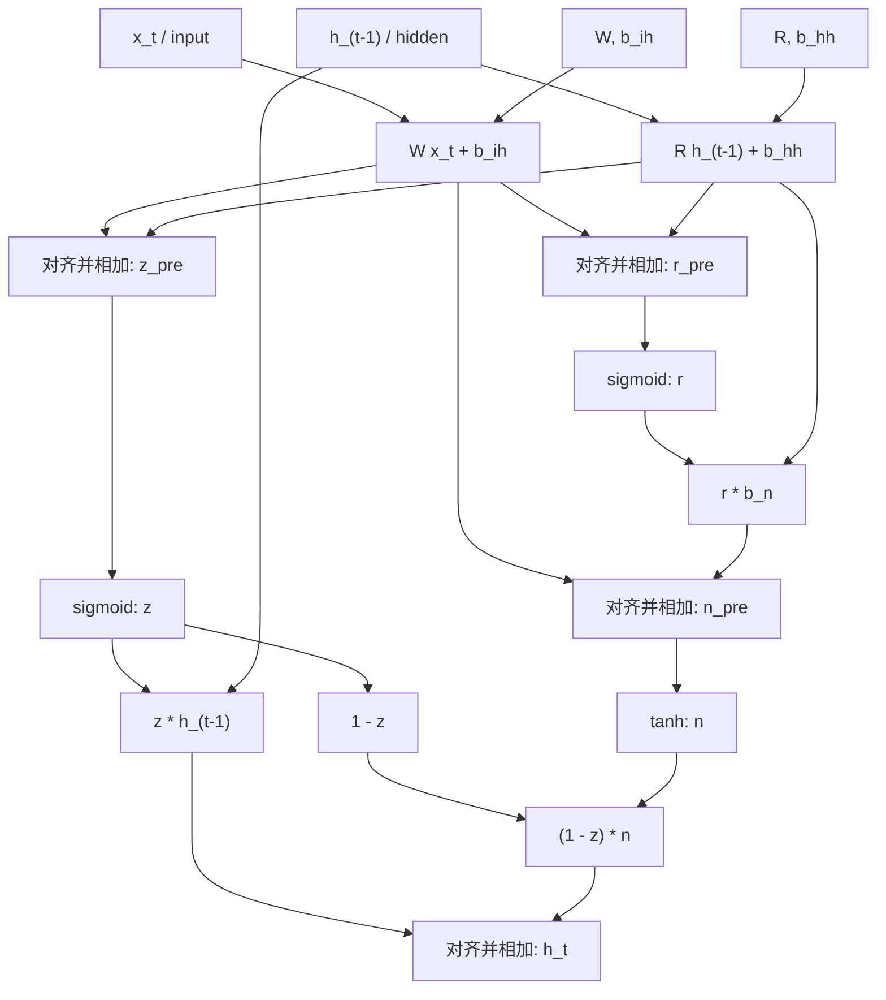
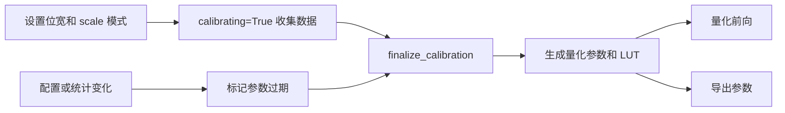

# QuantGRU 量化计算流程

本文档描述主 QuantGRU 实现的校准、参数表示和量化执行流程，对应
[quant_gru.py](../pytorch/quant_gru.py)、[quantize_param_types.h](../include/quantize_param_types.h)
和 [quantize_ops_helper.h](../include/quantize_ops_helper.h)。使用入口见
[README](../README.md)，配置字段见[配置说明](../pytorch/config/README.md)。

## 模块与数据流



Python 层管理配置、校准状态、双向执行和导出，binding 负责数据转换，C++/CUDA 层
负责量化、矩阵乘、门计算和梯度计算。

## GRU 递推与张量布局

用 `z` 表示更新门、`r` 表示重置门、`n` 表示候选状态，递推关系为：

```text
a = W x_t + b_ih
b = R h_(t-1) + b_hh

z = sigmoid(a_z + b_z)
r = sigmoid(a_r + b_r)
n = tanh(a_n + r * b_n)
h_t = z * h_(t-1) + (1 - z) * n
```

重置门作用于循环线性结果 `b_n`，该结果包含循环偏置。

| 对象 | Python 布局 |
| --- | --- |
| 默认序列输入 | `[T, B, I]` |
| `batch_first=True` 输入 | `[B, T, I]` |
| 单向输出 | `[T, B, H]` 或 `[B, T, H]` |
| 双向输出 | 最后一维为 `2H`，正向和反向结果按特征维拼接 |
| 隐藏状态 | `[D, B, H]`，单向 `D=1`，双向 `D=2` |

Python 参数沿用 PyTorch 的 `r/z/n` 门顺序。进入计算内核前，
`convert_weights_to_haste_format()` 将权重和偏置转为 `z/r/n` 门顺序和内核布局。

## 完整前向图



图中的蓝色节点表示两路线性变换，黄色节点表示量化网格对齐，绿色节点表示门激活，
橙色节点表示乘法，紫色节点表示输入和隐藏状态。



图中的每条边携带量化整数及其 scale、zero point。节点在执行前把输入转换到目标
量化网格。权重和偏置按输出通道保存参数，门输入输出和隐藏状态使用张量级参数。

## 量化基础公式

设实数 `x` 的量化参数为 scale `S_x`、zero point `Z_x`，整数范围为
`[Qmin_x, Qmax_x]`：

$$
q_x = \operatorname{clamp}\left(\operatorname{round}\left(\frac{x}{S_x}\right)+Z_x,
Qmin_x,Qmax_x\right)
$$

$$
\hat{x} = S_x(q_x-Z_x)
$$

### 网格转换

同一个实数从输入网格转换到输出网格：

$$
q_y = \operatorname{round}\left(\frac{S_x}{S_y}(q_x-Z_x)\right)+Z_y
$$

实现将比值 `S_x / S_y` 编码为 `Pot2Rescale`、`FixedPointScale` 或 `FloatRescale`，
并通过 `applyRescale()` 执行对应缩放。

### 不同网格的加法

`z = x + y` 的输出整数为：

$$
q_z =
\operatorname{round}\left(\frac{S_x}{S_z}(q_x-Z_x)\right)+
\operatorname{round}\left(\frac{S_y}{S_z}(q_y-Z_y)\right)+Z_z
$$

两个输入先转换到输出网格，再执行整数加法。每个转换产生独立舍入误差。

### 不同网格的乘法

`z = x y` 的乘积网格为 `S_x S_y`：

$$
q_z =
\operatorname{round}\left(\frac{S_xS_y}{S_z}(q_x-Z_x)(q_y-Z_y)\right)+Z_z
$$

内核使用 int64 保存中间乘积，再按目标位宽截断。候选门和隐藏状态更新把乘积直接
转换到目标网格，省去独立中间张量的写回与再次读取。

## 校准与参数生命周期



校准前向执行浮点 GRU，并收集输入、隐藏状态、两路线性结果、门输入输出及乘法
中间量的统计。MinMax 使用范围极值；SQNR 和 Percentile 使用直方图统计。
`finalize_calibration()` 通过 binding 调用对应参数计算接口。

MinMax 的输入与隐藏状态范围使用全局极值累计。隐藏状态统计从 `h[1]` 开始，
初始状态 `h[0]` 的处理前提为零初始化。有状态部署需要额外检查初始状态范围覆盖。

配置加载、统一位宽设置、scale 模式切换和校准统计更新通过 `_quant_params_dirty`
标记参数过期。常规量化前向与导出流程在消费参数前检查更新状态，
`_quant_params_locked` 控制已加载参数的覆盖行为。
参数过期且缺少校准数据时，重新校准或重新加载匹配的参数。

## 量化参数与执行表示

通用量化关系为：

```text
q = clamp(round(x / s + zp), qmin, qmax)
x_hat = s * (q - zp)
```

| 结构 | 数据和用途 |
| --- | --- |
| `QuantParam` | 保存一个量化点的 `scale` 和 `zero_point` |
| `ChannelQuantParam` | 保存权重或偏置的逐通道参数与粒度信息 |
| `GRUQuantParams` | 聚合配置、各量化点参数以及三份门激活 LUT |
| `Pot2Rescale` | Po2 重缩放的移位量 |
| `FixedPointScale` | affine 重缩放的 16 位乘子和移位量 |
| `FloatRescale` | 浮点执行用的缩放比 |
| `GateQuantParamsT<R>`、`LinearQuantParamsGPUT<R>` | 整数门计算和线性计算的设备参数 |
| `GateQuantParamsFP`、`LinearRescaleParamsFP` | float32 存储路径的设备参数 |

权重、偏置统一保存 `3H` 个通道参数。per-tensor 和 per-gate 模式把对应 scale
广播到逐通道数组，执行阶段按通道读取。

Python binding 对外提供 `scale_x_`、`zp_x_` 和 `scale_W_` 等字段，
`from_cpp()`、`to_cpp()` 完成这些字段与 C++ 结构的转换。

## Affine 与 Power-of-2

独立 QuantGRU 默认 `use_pot2_scale=False`。affine 模式在参数结构中保存连续 scale，
执行阶段通过 [scale_encoding.h](../include/scale_encoding.h) 将缩放比近似为
`M * 2^-shift`。`M` 存储为 `uint16_t`，`shift` 存储为 `int8_t`。

`use_pot2_scale=True` 启用 Po2。此时保存的 scale 为 `2^-n`，默认策略为
`CoverRange`，容差为 2%。范围接近 2 的幂时对指数取最近整数，其余情况向覆盖方向
取整。策略实现在 [pot_scale_encode.h](../include/pot_scale_encode.h)。

重缩放将源网格上的去零点整数转换到目标网格：

```text
q_dst = clamp(rescale(q_src - zp_src, s_src / s_dst) + zp_dst)
```

`setRescaleParam()` 从基础参数派生设备执行表示，`applyRescale()` 按类型执行乘移、
移位或浮点缩放。有限位宽下的舍入和截断需要通过输出误差验证。

## 执行后端

| 入口或配置 | 存储与执行 | 激活函数 |
| --- | --- | --- |
| `use_quantization=False` | CUDA 浮点 GRU | 浮点 sigmoid/tanh |
| `quant_storage_dtype="float32"`（量化默认） | 量化值以 float32 存储，cuBLAS GEMM 加重缩放 | 反量化、浮点 sigmoid/tanh、再量化 |
| `quant_storage_dtype="int32"` | 量化值以 int32 存储，整数内核执行 | 默认 16 段 PWL |
| `forward_quantized()` | CUDA 整数张量输入输出，使用整数执行路径 | 默认 16 段 PWL |

整数路径的 `USE_REAL_ACTIVATION` 编译宏可启用浮点激活计算分支，当前默认构建使用
PWL。存储模式、量化位宽与 scale 模式分别控制不同的行为。

常规 `forward()` 返回浮点张量；`forward_quantized()` 的调用方按
`get_io_quant_meta()` 给出的输入和隐藏状态网格准备 INT32 张量，并按输出网格解释
返回值。切换后端时需要分别验证输出和梯度。

## 线性层与门计算

输入线性层一次计算全部时间步的 `W x + b_ih`。循环线性层逐步计算
`R h + b_hh`。权重和偏置采用零点为 0 的对称配置，输入零点通过权重和补偿：

```text
acc = sum(q_W * q_x) - zp_x * sum(q_W)
```

偏置先从自身 scale 转到累加器的 `s_W * s_x` 网格，再与累加器结果相加，
整体对齐到线性层输出网格。循环线性层采用相同关系。

### 两路线性变换

对输出通道 `c`，输入线性层先计算整数 GEMM 与零点补偿：

$$
G_x[c]=\sum_k q_W[c,k]q_x[k]-Z_x\sum_k q_W[c,k]
$$

权重和偏置采用对称网格，因此 `Z_W=Z_{b_ih}=0`。偏置先转换到累加器网格：

$$
B_x[c]=\operatorname{round}\left(
\frac{S_{b_ih[c]}}{S_{W[c]}S_x}q_{b_ih}[c]\right)
$$

累加器和偏置共同转换到输入线性输出 `a` 的网格：

$$
q_a[c]=\operatorname{round}\left(
\frac{S_{W[c]}S_x}{S_a}\left(G_x[c]+B_x[c]\right)\right)+Z_a
$$

循环线性层采用相同结构：

$$
G_h[c]=\sum_k q_R[c,k]q_h[k]-Z_h\sum_k q_R[c,k]
$$

$$
B_h[c]=\operatorname{round}\left(
\frac{S_{b_hh[c]}}{S_{R[c]}S_h}q_{b_hh}[c]\right)
$$

$$
q_b[c]=\operatorname{round}\left(
\frac{S_{R[c]}S_h}{S_b}\left(G_h[c]+B_h[c]\right)\right)+Z_b
$$

`a` 一次覆盖全部时间步，`b` 在每个时间步根据当前隐藏状态重新计算。通道 scale
由权重和偏置的 per-tensor、per-gate 或 per-channel 配置广播得到。

### 更新门与重置门

令 `g` 表示更新门或重置门的激活前网格。两路线性结果分别转换后相加：

$$
q_g=\operatorname{round}\left(\frac{S_a}{S_g}(q_a-Z_a)\right)+
\operatorname{round}\left(\frac{S_b}{S_g}(q_b-Z_b)\right)+Z_g
$$

激活模块从 `q_g` 得到 sigmoid 输出。float32 存储路径执行反量化、浮点 sigmoid 和
再量化；整数路径使用 16 段 PWL。

### 候选门

重置门输出与循环线性结果的乘积为：

$$
P_r=(q_r-Z_r)(q_{b_n}-Z_b)
$$

候选门输入直接把该乘积和输入线性结果转换到 `n_pre` 网格：

$$
q_{n\_pre}=\operatorname{round}\left(
\frac{S_a}{S_{n\_pre}}(q_{a_n}-Z_a)\right)+
\operatorname{round}\left(
\frac{S_rS_b}{S_{n\_pre}}P_r\right)+Z_{n\_pre}
$$

激活模块随后执行 tanh，并写入候选状态网格。

### 隐藏状态更新

候选状态先转换到隐藏状态网格：

$$
q_{n\rightarrow h}=\operatorname{round}\left(
\frac{S_n}{S_h}(q_n-Z_n)\right)+Z_h
$$

定义去零点整数：

$$
d_z=q_z-Z_z,\quad d_h=q_h-Z_h,\quad d_n=q_{n\rightarrow h}-Z_h
$$

常数 1 在更新门网格上的去零点整数为 `round(1/S_z)`，因此：

$$
d_{1-z}=\operatorname{round}(1/S_z)-d_z
$$

旧状态贡献和新状态贡献都位于 `S_z S_h` 乘积网格，能够先相加再共同转换：

$$
q_{h\_new}=\operatorname{round}\left(
\frac{S_zS_h}{S_h}(d_zd_h+d_{1-z}d_n)\right)+Z_h
$$

最终结果按隐藏状态位宽执行饱和截断。融合重缩放减少中间张量写回，有限位宽下仍会
产生乘子编码、舍入和截断误差。

门计算按以下顺序执行：

1. 更新门与重置门将两路线性结果对齐到各自输入网格，相加后执行 sigmoid。
2. 候选门将 `r * b_n` 直接对齐到候选门输入网格，与 `a_n` 相加后执行 tanh。
3. 隐藏状态更新先将候选状态对齐到隐藏状态网格，再在共享乘积网格中合并两项贡献，
   最后对齐并截断到输出范围。

`mul_reset_hidden`、`mul_old_contribution` 和 `mul_new_contribution` 保留在
配置、校准统计和参数结构中。执行内核融合对应乘积的重缩放，直接写入候选门输入或
隐藏状态网格。因此参数条目与执行时的独立截断点需要分别解释。

## 16 段分段线性激活

整数路径的 sigmoid/tanh 使用 [quantize_lut_types.h](../include/quantize_lut_types.h)
定义的 LUT，`NUM_SEGMENTS=16`。每个 QuantGRU 方向保存更新门、重置门和候选门的
三份表。

生成阶段根据实际输入、输出 scale 和零点计算分段边界，并为每段拟合
`y ≈ b_i * x + c_i`。实现位于 [quantize_ops.cu](../src/quantize_ops.cu)。
输出零点合并到截距预计算项中。

### 分段与最小二乘拟合

Sigmoid 输入范围限制在量化网格与 `[-8, 8]` 的交集，tanh 输入范围限制在量化网格
与 `[-4, 4]` 的交集。实现按函数斜率和中心区域权重生成 17 个边界，形成 16 段。
每段均匀采样 100 个点。

对第 `i` 段的 `m` 个样本 `(x_j, y_j)`，线性近似为：

$$
y_j\approx b_i x_j+c_i
$$

最小二乘系数为：

$$
b_i=\frac{m\sum_j x_jy_j-(\sum_jx_j)(\sum_jy_j)}
{m\sum_jx_j^2-(\sum_jx_j)^2}
$$

$$
c_i=\frac{\sum_jy_j-b_i\sum_jx_j}{m}
$$

### 系数量化

将 `x=S_x(q_x-Z_x)` 和 `y≈b_i x+c_i` 代入输出网格：

$$
q_y\approx b_i\frac{S_x}{S_y}(q_x-Z_x)+\frac{c_i}{S_y}+Z_y
$$

定义实数斜率乘子：

$$
M_i=b_i\frac{S_x}{S_y}
$$

实现选择 `n_i`，使 `q_{b_i}=round(M_i 2^{n_i})` 落入输出位宽范围，并保存：

$$
q_{b_i}=\operatorname{clip}\left(\operatorname{round}(M_i2^{n_i})\right)
$$

$$
C_i=\operatorname{round}\left(\frac{c_i}{S_y}+Z_y\right)
$$

$$
T_i=\operatorname{clamp}\left(
\operatorname{round}\left(\frac{x_{i,end}}{S_x}+Z_x\right)\right)
$$

`q_b`、`n_BX_total`、`term_c_precomputed` 和 `threshold` 分别保存
`q_{b_i}`、`n_i`、`C_i` 和 `T_i`。

| `SegmentParams` 字段 | 类型 | 用途 |
| --- | --- | --- |
| `q_b` | `int32_t` | 量化斜率 |
| `n_BX_total` | `int8_t` | 乘积重缩放移位量 |
| `term_c_precomputed` | `int32_t` | 含输出零点的截距项 |
| `threshold` | `int32_t` | 分段上界 |

运行时先按位宽截断输入，再按阈值选择分段，使用 int64 乘积计算：

```text
product = int64(q_b) * (q_x - zp_x)
term = rounded_shift(product, n_BX_total)
q_y = clamp(term + term_c_precomputed, qmin_y, qmax_y)
```

该式对应以下近似关系：

$$
q_y=\operatorname{clamp}\left(
\operatorname{round}\left(\frac{q_{b_i}(q_x-Z_x)}{2^{n_i}}\right)+C_i\right)
$$

正移位量执行带舍入的右移，负移位量执行左移。结构体占用由平台对齐规则决定。
实际近似误差取决于输入范围、分段拟合和位宽，评估同时记录误差分布和任务指标。

## QAT、导出与重载

量化训练前向保留输入、参数和门计算的截断 mask。反向以浮点梯度计算，并将被截断
位置的梯度置零。整数存储路径在反向入口转换保存的量化值，复用梯度计算实现。

`export_quant_params()` 保存模型信息和算子级 scale、零点、位宽、范围与粒度，
双向模型同时保存反向参数。导出前同步待更新参数，重载按同一模型结构恢复权重和
量化参数。

ONNX 导出使用 `export_mode` 生成标准 GRU 节点。下游整图工具负责图命名和
encodings 组装。

## 源码索引与验证

| 文件 | 职责 |
| --- | --- |
| [pytorch/quant_gru.py](../pytorch/quant_gru.py) | 模型接口、状态与参数导入导出 |
| [pytorch/lib/gru_interface_binding.cc](../pytorch/lib/gru_interface_binding.cc) | Python/C++ 数据转换 |
| [src/gru_interface.cc](../src/gru_interface.cc) | 校准参数计算与执行接口 |
| [src/calibration_gpu.cu](../src/calibration_gpu.cu) | GPU 范围与直方图统计 |
| [include/scale_encoding.h](../include/scale_encoding.h) | scale 编码与重缩放参数派生 |
| [src/gru_forward_gpu_quant.cu](../src/gru_forward_gpu_quant.cu) | 整数存储前向 |
| [src/gru_forward_gpu_quant_fp.cu](../src/gru_forward_gpu_quant_fp.cu) | float32 存储量化前向 |
| [src/gru_backward_gpu_quant.cu](../src/gru_backward_gpu_quant.cu) | 量化训练反向 |
| [pytorch/test_quant_gru.py](../pytorch/test_quant_gru.py) | 输出、梯度和误差检查 |

[独立 CPU 参考实现](../quant-gru-cpu-only/README.md) 使用自身的 `shift_*` 参数结构。
主实现与该参考实现的数值一致性需要在统一输入、权重和量化参数后单独验证。

变更验证覆盖校准前后输出、两个执行后端、双向参数、QAT 梯度以及保存重载。
结果同时记录 scale 模式、位宽、GPU 与依赖版本。
